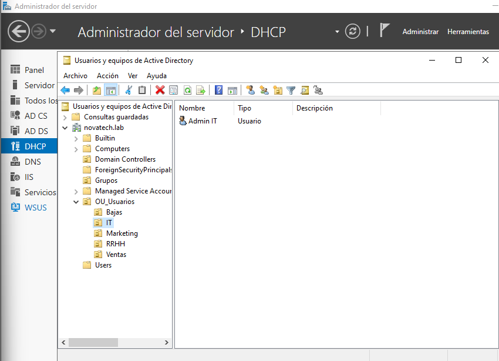
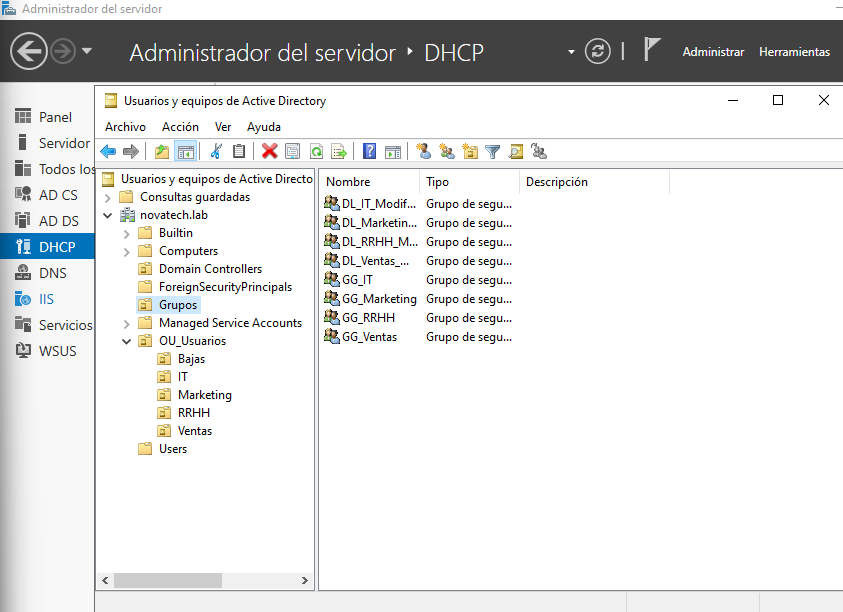

# 📂 02 - Active Directory

## Dominio

- **Nombre:** novatech.lab
- **NetBIOS:** NOVATECH
- **Nivel funcional:** Windows Server 2022

## Estructura de OUs
novatech.lab
├── OU_Usuarios
│ ├── Ventas
│ ├── Marketing
│ ├── IT
│ ├── RRHH
│ └── Bajas
└── Grupos

## Grupos Globales

| Grupo | Miembros |
|-------|----------|
| GG_Ventas | carlos.garcia |
| GG_Marketing | pablo.lopez |
| GG_IT | admin.it |
| GG_RRHH | ana.ramirez |

## Grupos Domain Local

| Grupo | Contiene | Permisos |
|-------|----------|----------|
| DL_Ventas_Modificar | GG_Ventas | Modify en \\SRV-DC01\Ventas |
| DL_Marketing_Modificar | GG_Marketing | Modify en \\SRV-DC01\Marketing |
| DL_IT_Modificar | GG_IT | Modify en \\SRV-DC01\IT |
| DL_RRHH_Modificar | GG_RRHH | Modify en \\SRV-DC01\RRHH |

## Modelo AGDLP
Usuario → GG_Departamento → DL_Departamento_Modificar → Permisos NTFS

## Usuarios de prueba

| Nombre | SamAccountName | Departamento | Contraseña |
|--------|---------------|--------------|------------|
| Ana Ramirez | ana.ramirez | RRHH | Hola1234 |
| Carlos Garcia | carlos.garcia | Ventas | Hola1234 |
| Pablo Lopez | pablo.lopez | Marketing | Hola1234 |
| Admin IT | admin.it | IT | Hola1234 |

## Capturas

