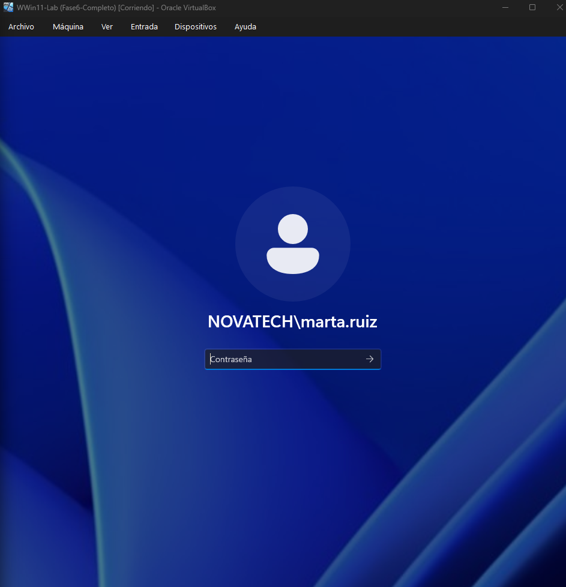
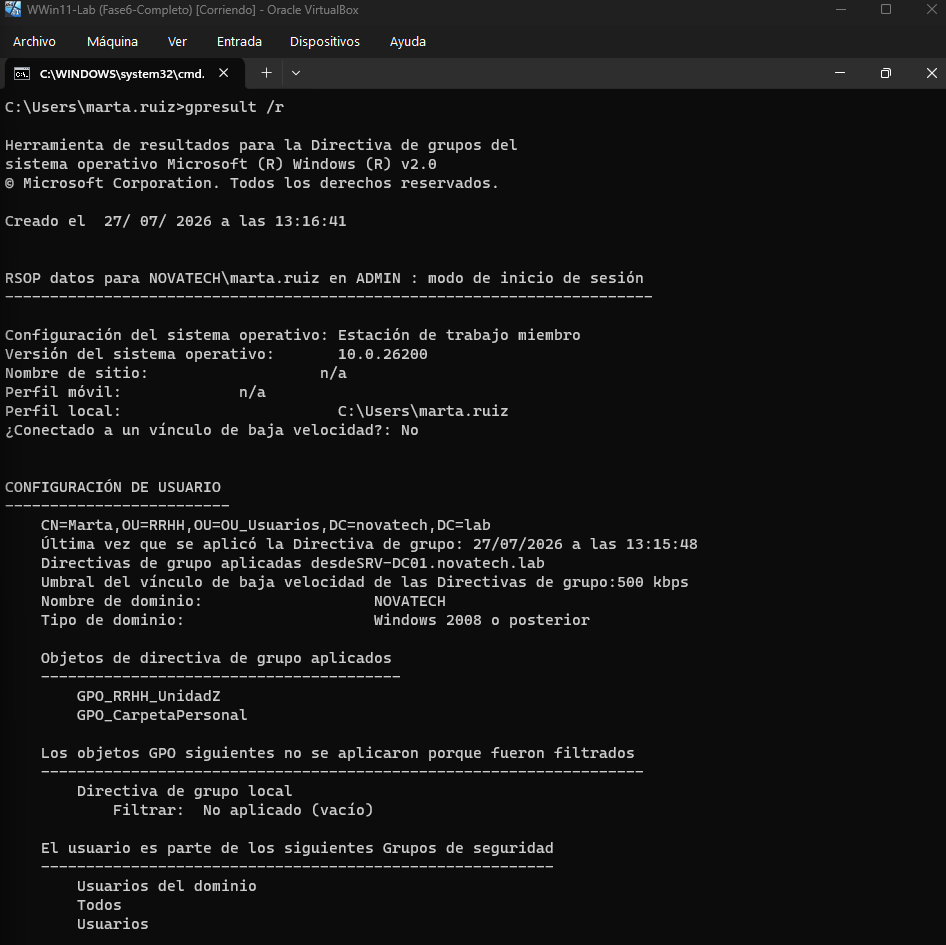

# 🖥️ SysAdmin Lab - Infraestructura Windows

Laboratorio profesional de administración de sistemas Windows montado en VirtualBox.

## 🧱 Infraestructura

| Servidor | Sistema | Roles |
|----------|---------|-------|
| SRV-DC01 | Windows Server 2022 | AD DS, DNS, DHCP, File Server, WSUS, PKI |
| Win11-Lab | Windows 11 Pro | Cliente unido al dominio |

## 🌐 Dominio

- **Dominio:** novatech.lab
- **IP del DC (red interna):** 192.168.100.10
- **Máscara:** 255.255.255.0

## 📂 Estructura de OUs

- OU_Usuarios
  - Ventas
  - Marketing
  - IT
  - RRHH
  - Bajas
- Grupos

## 👥 Usuarios de prueba

| Usuario | Departamento |
|---------|--------------|
| ana.ramirez | RRHH |
| carlos.garcia | Ventas |
| pablo.lopez | Marketing |
| admin.it | IT |

## 🔐 AGDLP

Todos los usuarios siguen el modelo AGDLP: Usuario → GG_Departamento → DL_Departamento_Modificar → Permisos NTFS

## 📁 Recursos compartidos

- `\\SRV-DC01\Ventas`
- `\\SRV-DC01\Marketing`
- `\\SRV-DC01\IT`
- `\\SRV-DC01\RRHH`
- `\\SRV-DC01\Usuarios` (carpetas personales)

## 🧠 GPOs configuradas

- GPO_Ventas_UnidadZ → Mapea Z: a Ventas
- GPO_Marketing_UnidadZ → Mapea Z: a Marketing
- GPO_RRHH_UnidadZ → Mapea Z: a RRHH
- GPO_CarpetaPersonal → Mapea P: a carpeta personal

## ⚙️ PowerShell

- `New-OnboardUser`: Crea usuario, grupo, carpeta y permisos
- `Remove-OffboardUser`: Deshabilita y mueve a Bajas
- `Get-UserReport`: Exporta usuarios a CSV

## 🛡️ Seguridad

- Windows Defender activo
- Firewall activo en los 3 perfiles
- Política de contraseñas: 7 caracteres, complejidad, 42 días

## 📦 Servicios adicionales

- **WSUS:** Servidor de actualizaciones instalado
- **PKI:** Autoridad de certificación empresarial (novatech-CA)

- ## Capturas del laboratorio

---
*Laboratorio montado con fines educativos y de demostración profesional.*
